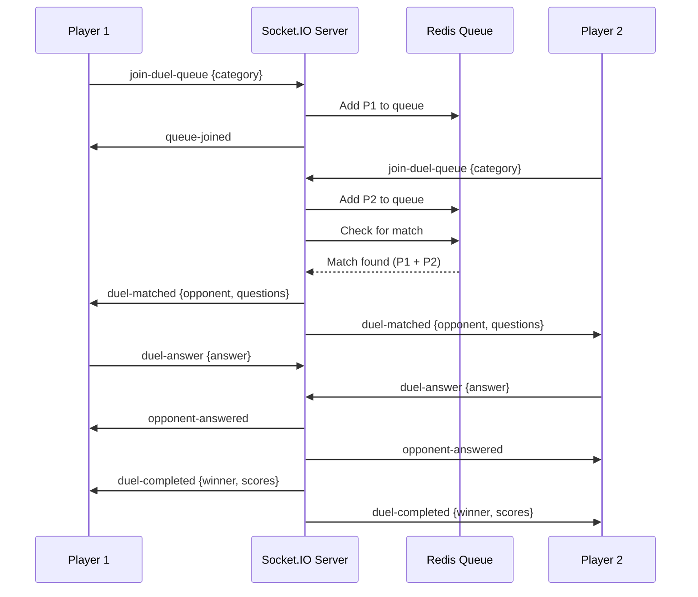

## Architecture Overview

GeoChallenge is built as a modern full-stack web application with a clear separation between frontend and backend, connected via REST API and WebSocket channels for real-time features.

```mermaid
graph TB
    Client[React Frontend<br/>Vite + TypeScript]
    API[Express Backend<br/>REST API]
    WS[Socket.IO<br/>WebSocket Server]
    DB[(PostgreSQL<br/>Database)]
    Cache[(Redis<br/>Cache & Sessions)]
    
    Client -->|HTTP/REST| API
    Client <-->|WebSocket| WS
    API --> DB
    API --> Cache
    WS --> Cache
    WS --> DB
    
    style Client fill:#61dafb
    style API fill:#68a063
    style WS fill:#010101
    style DB fill:#336791
    style Cache fill:#dc382d
```



## Tech Stack

### Frontend

<CardGroup cols={2}>
  <Card title="React 18" icon="react">
    Component-based UI library with hooks for state management
  </Card>
  <Card title="Vite" icon="bolt">
    Next-generation build tool with instant HMR and optimized production builds
  </Card>
  <Card title="TypeScript" icon="code">
    Type-safe development with full IDE support
  </Card>
  <Card title="Tailwind CSS" icon="palette">
    Utility-first CSS framework with custom design tokens
  </Card>
  <Card title="React Router" icon="route">
    Declarative routing with protected routes and lazy loading
  </Card>
  <Card title="Socket.IO Client" icon="plug">
    Real-time bidirectional communication
  </Card>
  <Card title="Axios" icon="globe">
    HTTP client with interceptors and automatic retries
  </Card>
  <Card title="Leaflet" icon="map">
    Interactive maps for geography questions
  </Card>
  <Card title="i18next" icon="language">
    Internationalization with language detection
  </Card>
  <Card title="Zod" icon="shield">
    Schema validation for forms and API responses
  </Card>
  <Card title="Vitest + Playwright" icon="vial">
    Unit testing and E2E testing frameworks
  </Card>
  <Card title="PWA" icon="mobile">
    Progressive Web App with offline support
  </Card>
</CardGroup>

#### Frontend Package.json

```json
{
  "name": "geochallenge-frontend",
  "version": "1.2.71",
  "type": "module",
  "dependencies": {
    "axios": "^1.6.7",
    "i18next": "^23.10.0",
    "leaflet": "^1.9.4",
    "react": "^18.2.0",
    "react-router-dom": "^6.22.2",
    "socket.io-client": "^4.7.4",
    "zod": "^3.23.8"
  }
}
```

### Backend

<CardGroup cols={2}>
  <Card title="Node.js + Express" icon="server">
    Fast, minimalist web framework for the REST API
  </Card>
  <Card title="TypeScript" icon="code">
    Type safety on the backend with ES modules
  </Card>
  <Card title="Prisma" icon="database">
    Modern ORM with type-safe database client
  </Card>
  <Card title="PostgreSQL" icon="elephant">
    Robust relational database for persistent data
  </Card>
  <Card title="Redis" icon="memory">
    In-memory cache for sessions, matchmaking queues, and game state
  </Card>
  <Card title="Socket.IO Server" icon="bolt">
    Real-time engine for duels and live updates
  </Card>
  <Card title="JWT" icon="key">
    JSON Web Tokens for stateless authentication
  </Card>
  <Card title="bcrypt" icon="lock">
    Password hashing with salt rounds
  </Card>
  <Card title="Helmet" icon="shield">
    Security middleware for Express
  </Card>
  <Card title="CORS" icon="arrows-turn-right">
    Cross-origin resource sharing configuration
  </Card>
  <Card title="Rate Limiting" icon="gauge">
    Express rate limiter to prevent abuse
  </Card>
  <Card title="dotenv" icon="gear">
    Environment variable management
  </Card>
</CardGroup>

#### Backend Package.json

```json
{
  "name": "geochallenge-backend",
  "version": "1.0.0",
  "dependencies": {
    "@prisma/client": "^5.10.0",
    "bcryptjs": "^2.4.3",
    "cors": "^2.8.5",
    "express": "^4.18.3",
    "express-rate-limit": "^8.2.1",
    "helmet": "^7.1.0",
    "ioredis": "^5.3.2",
    "jsonwebtoken": "^9.0.2",
    "socket.io": "^4.7.4",
    "zod": "^3.22.4"
  }
}
```

## Frontend Architecture

### Project Structure

```
frontend/src/
├── components/         # Atomic Design structure
│   ├── atoms/         # Button, Icon, Input, Badge
│   ├── molecules/     # Card, FormField, ListItem
│   ├── organisms/     # Header, Modal, ScreenLayout
│   └── templates/     # Reusable page layouts
├── context/           # React Context providers
│   ├── AuthContext.tsx
│   └── GameContext.tsx
├── hooks/             # Custom React hooks
│   ├── useLocalStorage.ts
│   ├── useFormValidation.ts
│   └── useApi.ts
├── pages/             # Route components
│   ├── HomePage.tsx
│   ├── MenuPage.tsx
│   ├── GamePage.tsx
│   └── DuelPage.tsx
├── services/          # API and Socket clients
│   ├── api.ts
│   └── socket.ts
├── types/             # TypeScript type definitions
├── utils/             # Helper functions
└── App.tsx            # Root component with routing
```

### Key Frontend Patterns

#### Atomic Design

The UI is organized using Atomic Design principles:

```typescript
// atoms/Button.tsx - Simple, reusable button
export function Button({ 
  children, 
  variant = 'primary', 
  size = 'md',
  ...props 
}) {
  return (
    <button
      className={cn(
        'rounded-lg transition-colors',
        variantStyles[variant],
        sizeStyles[size]
      )}
      {...props}
    >
      {children}
    </button>
  );
}
```

```typescript
// organisms/Header.tsx - Complex composition
export function Header({ actions }) {
  return (
    <header className="app-header">
      <Logo />
      <nav>{actions}</nav>
    </header>
  );
}
```

#### Context Providers

**AuthContext** manages authentication state globally:

```typescript
// context/AuthContext.tsx
export function AuthProvider({ children }) {
  const [token, setToken] = useLocalStorage('token', null);
  const [state, setState] = useState<AuthState>({
    user: null,
    token,
    isLoading: true,
    isAuthenticated: false,
  });

  const login = async (email: string, password: string) => {
    const normalizedEmail = normalizeEmail(email);
    const response = await api.login(normalizedEmail, password);
    
    setToken(response.token);
    setState({
      user: response.user,
      token: response.token,
      isLoading: false,
      isAuthenticated: true,
    });
    
    // Connect socket in background
    socketService.connect(response.token).catch(console.error);
  };

  return (
    <AuthContext.Provider value={{ ...state, login, logout, register }}>
      {children}
    </AuthContext.Provider>
  );
}
```

**GameContext** manages single-player game state:

```typescript
// context/GameContext.tsx
export function GameProvider({ children }) {
  const [state, dispatch] = useReducer(gameReducer, initialState);

  const startGame = async (category: Category) => {
    dispatch({ type: 'START_LOADING' });
    const questions = await api.startGame(category);
    dispatch({ type: 'START_GAME', payload: questions });
  };

  const submitAnswer = async (answer: string) => {
    const result = await api.submitAnswer({
      questionId: currentQuestion.id,
      answer,
      timeRemaining,
    });
    dispatch({ type: 'SUBMIT_ANSWER', payload: result });
  };

  return (
    <GameContext.Provider value={{ state, startGame, submitAnswer }}>
      {children}
    </GameContext.Provider>
  );
}
```

#### Routing with Protection

```typescript
// App.tsx
function ProtectedRoute({ children }) {
  const { user, isLoading } = useAuth();
  
  if (isLoading) return <AuthRouteLoading />;
  if (!user) return <Navigate to="/login" replace />;
  
  return <>{children}</>;
}

const router = createBrowserRouter([
  {
    element: <RootProviders />,
    children: [
      { path: '/', element: <HomePage /> },
      { path: '/login', element: <PublicRoute><LoginPage /></PublicRoute> },
      { path: '/menu', element: <ProtectedRoute><MenuPage /></ProtectedRoute> },
      { path: '/game/single', element: <ProtectedRoute><GamePage /></ProtectedRoute> },
      { path: '/duel', element: <ProtectedRoute><DuelPage /></ProtectedRoute> },
    ],
  },
]);
```

### Mobile-First Design System

GeoChallenge uses CSS custom properties for a consistent design system:

```css
:root {
  /* Colors */
  --primary-bg: hsl(195, 85%, 41%);
  --correct-green: hsl(142, 76%, 36%);
  --error-red: hsl(0, 84%, 60%);
  
  /* Spacing */
  --space-xs: 0.25rem;
  --space-sm: 0.5rem;
  --space-md: 1rem;
  
  /* Mobile viewport */
  --viewport-height: 100dvh; /* Dynamic viewport height */
  --safe-area-top: env(safe-area-inset-top);
  --safe-area-bottom: env(safe-area-inset-bottom);
}

/* Dark mode */
@media (prefers-color-scheme: dark) {
  :root {
    --bg-primary: hsl(222, 47%, 11%);
    --text-primary: hsl(0, 0%, 100%);
  }
}
```

**Zero-Scroll Game Layout**:

```typescript
// components/GameRoundScaffold.tsx
export function GameRoundScaffold({ children }) {
  return (
    <div className="universal-game-layout" style={{ height: '100dvh' }}>
      <header style={{ paddingTop: 'var(--safe-area-top)' }}>
        {/* Timer, Score, Progress */}
      </header>
      
      <main style={{ flex: 1, minHeight: 0, overflowY: 'auto' }}>
        {/* Question and options */}
      </main>
      
      <footer style={{ paddingBottom: 'var(--safe-area-bottom)' }}>
        {/* Confirm/Next buttons */}
      </footer>
    </div>
  );
}
```

## Backend Architecture

### Project Structure

```
backend/src/
├── config/            # Configuration modules
│   ├── env.ts         # Environment variables
│   ├── database.ts    # Prisma client
│   └── redis.ts       # Redis connection
├── controllers/       # Route handlers
│   ├── auth.controller.ts
│   ├── game.controller.ts
│   ├── leaderboard.controller.ts
│   └── challenge.controller.ts
├── middleware/        # Express middleware
│   ├── auth.ts        # JWT verification
│   └── rateLimit.ts   # Rate limiting
├── services/          # Business logic
│   ├── auth.service.ts
│   ├── game.service.ts
│   └── question.service.ts
├── sockets/           # Socket.IO handlers
│   ├── index.ts
│   ├── duel.handler.ts
│   └── duel.utils.ts
├── prisma/            # Database schema
│   └── schema.prisma
├── seed.ts            # Database seeding
└── index.ts           # Server entry point
```

### Database Schema

GeoChallenge uses PostgreSQL with Prisma for type-safe database access:

```prisma
// prisma/schema.prisma
model User {
  id                String      @id @default(cuid())
  username          String      @unique
  email             String      @unique
  passwordHash      String
  preferredLanguage String      @default("es")
  highScore         Int         @default(0)
  gamesPlayed       Int         @default(0)
  wins              Int         @default(0)
  losses            Int         @default(0)
  createdAt         DateTime    @default(now())
  updatedAt         DateTime    @updatedAt

  games              GameResult[]
  challengesCreated  Challenge[]  @relation("ChallengeCreator")
  challengeParticipations ChallengeParticipant[]
}

model Question {
  id             String   @id @default(cuid())
  category       Category
  questionData   String   // Country name or question text
  options        String[] // Multiple choice options
  correctAnswer  String
  imageUrl       String?  // Flag or silhouette URL
  latitude       Float?   // For map questions
  longitude      Float?   // For map questions
  continent      String?
  difficulty     Difficulty @default(MEDIUM)
  createdAt      DateTime @default(now())
}

model GameResult {
  id            String   @id @default(cuid())
  userId        String
  score         Int
  correctCount  Int
  totalQuestions Int
  category      Category?
  gameMode      GameMode @default(SINGLE)
  details       Json?    // Question-by-question breakdown
  createdAt     DateTime @default(now())

  user User @relation(fields: [userId], references: [id])
}

enum Category {
  MAP
  FLAG
  CAPITAL
  SILHOUETTE
  MIXED
}

enum Difficulty {
  EASY
  MEDIUM
  HARD
}

enum GameMode {
  SINGLE
  DUEL
  CHALLENGE
}
```

### Key Backend Patterns

#### Environment Configuration

```typescript
// config/env.ts
import dotenv from 'dotenv';
dotenv.config();

const isProduction = process.env.NODE_ENV === 'production';

if (isProduction) {
  const required = ['DATABASE_URL', 'JWT_SECRET', 'REDIS_URL', 'FRONTEND_URL'];
  const missing = required.filter((key) => !process.env[key]);
  if (missing.length > 0) {
    throw new Error(`Missing required environment variables: ${missing.join(', ')}`);
  }
}

export const config = {
  port: parseInt(process.env.PORT || '3001', 10),
  nodeEnv: process.env.NODE_ENV || 'development',
  database: { url: process.env.DATABASE_URL || '' },
  redis: { url: process.env.REDIS_URL || 'redis://localhost:6379' },
  jwt: {
    secret: process.env.JWT_SECRET || 'default-secret-change-me',
    expiresIn: process.env.JWT_EXPIRES_IN || '24h',
  },
  frontend: { url: process.env.FRONTEND_URL || 'http://localhost:5173' },
  game: {
    questionsPerGame: 10,
    timePerQuestion: 10,
    basePoints: 100,
    maxTimeBonus: 50,
  },
};
```

#### Redis for Caching and Sessions

```typescript
// config/redis.ts
import Redis from 'ioredis';
import { config } from './env.js';

let redis: Redis | null = null;

export function getRedis(): Redis {
  if (!redis) {
    redis = new Redis(config.redis.url, {
      maxRetriesPerRequest: 3,
      retryStrategy(times) {
        const delay = Math.min(times * 50, 2000);
        return delay;
      },
    });

    redis.on('connect', () => {
      console.log('✅ Redis connected successfully');
    });

    redis.on('error', (err) => {
      console.error('❌ Redis connection error:', err.message);
    });
  }

  return redis;
}
```

#### Express Server Setup

```typescript
// index.ts
import express from 'express';
import cors from 'cors';
import helmet from 'helmet';
import { createServer } from 'http';
import { Server as SocketIOServer } from 'socket.io';
import { config } from './config/env.js';
import { setupSocketHandlers } from './sockets/index.js';

const app = express();
app.set('trust proxy', 1);
const httpServer = createServer(app);

const io = new SocketIOServer(httpServer, {
  cors: {
    origin: config.frontend.url,
    methods: ['GET', 'POST'],
    credentials: true,
  },
});

// Middleware
app.use(helmet());
app.use(cors({ origin: config.frontend.url, credentials: true }));
app.use(express.json({ limit: '1mb' }));
app.use(globalLimiter);

// Health check
app.get('/health', async (_req, res) => {
  try {
    await prisma.$queryRaw`SELECT 1`;
    const redis = getRedis();
    await redis.ping();
    res.json({ 
      status: 'ok', 
      db: 'ok', 
      redis: 'ok', 
      timestamp: new Date().toISOString() 
    });
  } catch (error: any) {
    res.status(503).json({ 
      status: 'degraded', 
      error: error.message, 
      timestamp: new Date().toISOString() 
    });
  }
});

// API Routes
app.use('/api/auth', authController);
app.use('/api/game', gameController);
app.use('/api/leaderboard', leaderboardController);
app.use('/api/challenges', challengeController);

// Setup Socket.IO handlers
setupSocketHandlers(io);

httpServer.listen(config.port, () => {
  console.log(`🚀 Server running on port ${config.port}`);
});
```

## Real-Time Architecture (Socket.IO)

### Duel Matchmaking Flow



### Socket Event Handlers

```typescript
// sockets/duel.handler.ts
export function setupDuelHandlers(io: SocketIOServer) {
  io.on('connection', (socket) => {
    socket.on('join-duel-queue', async ({ category, token }) => {
      // Verify JWT
      const user = await verifyToken(token);
      
      // Add to Redis queue
      await redis.sadd(`duel:queue:${category}`, user.id);
      socket.join(`duel-queue-${user.id}`);
      
      socket.emit('queue-joined', { category });
      
      // Attempt matchmaking
      await attemptMatchmaking(category, io);
    });

    socket.on('duel-answer', async ({ duelId, answer }) => {
      // Record answer in Redis
      await redis.hset(`duel:${duelId}:answers`, socket.data.userId, answer);
      
      // Notify opponent
      socket.to(`duel-${duelId}`).emit('opponent-answered');
      
      // Check if both answered
      const answers = await redis.hgetall(`duel:${duelId}:answers`);
      if (Object.keys(answers).length === 2) {
        await completeDuelRound(duelId, io);
      }
    });
  });
}
```

## Deployment

### Frontend Deployment (GitHub Pages)

The frontend is deployed to GitHub Pages with automated CI/CD:

```yaml
# .github/workflows/deploy-frontend.yml
name: Deploy Frontend

on:
  push:
    branches: [main]
    paths:
      - 'frontend/**'
      - '.github/workflows/deploy-frontend.yml'

jobs:
  quality-gate:
    runs-on: ubuntu-latest
    steps:
      - uses: actions/checkout@v3
      - uses: actions/setup-node@v3
      - run: npm ci --prefix frontend
      - run: npm run lint --prefix frontend
      - run: npm run test --prefix frontend
      - run: npm run build --prefix frontend
      - uses: actions/upload-artifact@v3
        with:
          name: dist
          path: frontend/dist

  deploy:
    needs: quality-gate
    runs-on: ubuntu-latest
    steps:
      - uses: actions/download-artifact@v3
      - uses: peaceiris/actions-gh-pages@v3
        with:
          github_token: ${{ secrets.GITHUB_TOKEN }}
          publish_dir: ./dist
```

### Backend Deployment (Render/Railway)

The backend is typically deployed to platforms like Render or Railway:

```bash
# Start script
npm run start:prod
# Which runs:
npx prisma migrate deploy && node dist/index.js
```

**Required Environment Variables**:
- `DATABASE_URL`: PostgreSQL connection string
- `REDIS_URL`: Redis connection string
- `JWT_SECRET`: Secret key for JWT signing
- `FRONTEND_URL`: Allowed CORS origin
- `PORT`: Server port (default 3001)

## Performance Optimizations

<AccordionGroup>
  <Accordion title="Frontend Optimizations" icon="rocket">
    - **Code splitting**: Lazy-loaded components (e.g., `MapInteractive`)
    - **Bundle optimization**: Vite's automatic tree-shaking and minification
    - **Image optimization**: Sharp for processing flag/silhouette images
    - **PWA caching**: Service workers cache static assets
    - **Debounced inputs**: Search fields use debounce to reduce API calls
  </Accordion>
  
  <Accordion title="Backend Optimizations" icon="server">
    - **Redis caching**: Question pools cached to reduce database queries
    - **Database indexing**: Indexes on `email`, `username`, `userId`, `category`
    - **Connection pooling**: Prisma connection pooling for PostgreSQL
    - **Rate limiting**: Prevents abuse and ensures fair resource allocation
    - **Graceful shutdown**: Proper cleanup of database and Redis connections
  </Accordion>
  
  <Accordion title="Real-Time Optimizations" icon="bolt">
    - **Redis for game state**: Temporary game data stored in Redis, not PostgreSQL
    - **Room-based broadcasting**: Socket.IO rooms minimize unnecessary event delivery
    - **Compression**: Socket.IO compression for large payloads
    - **Heartbeat mechanism**: Keep-alive pings prevent cold starts on free tiers
  </Accordion>
</AccordionGroup>

## Security Measures

<Steps>
  <Step title="Authentication">
    JWT tokens with secure secret keys, bcrypt password hashing with salt rounds
  </Step>
  <Step title="Authorization">
    Middleware verification on protected routes, socket authentication on connection
  </Step>
  <Step title="Rate Limiting">
    Express rate limiter on all endpoints, stricter limits on auth routes
  </Step>
  <Step title="Input Validation">
    Zod schemas for request validation, Prisma type safety
  </Step>
  <Step title="Security Headers">
    Helmet middleware for CSP, HSTS, X-Frame-Options
  </Step>
  <Step title="CORS">
    Strict CORS policy allowing only configured frontend origin
  </Step>
</Steps>

---

<Tip>
  The architecture is designed to scale horizontally. Redis enables session sharing across multiple backend instances, and PostgreSQL can be scaled with read replicas.
</Tip>

## Next Steps

<CardGroup cols={2}>
  <Card
    title="API Reference"
    icon="code"
    href="/api/auth/register"
  >
    Explore REST endpoints and WebSocket events
  </Card>
  <Card
    title="Database Schema"
    icon="database"
    href="/development/database"
  >
    Detailed schema documentation
  </Card>
  <Card
    title="Development Setup"
    icon="code-branch"
    href="/development/setup"
  >
    Learn how to set up GeoChallenge for development
  </Card>
  <Card
    title="Deployment Guide"
    icon="rocket"
    href="/deployment/github-pages"
  >
    Deploy your own instance of GeoChallenge
  </Card>
</CardGroup>